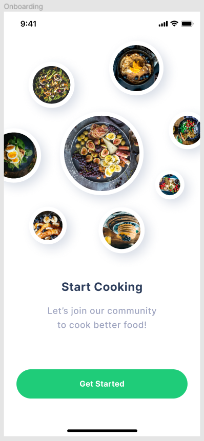
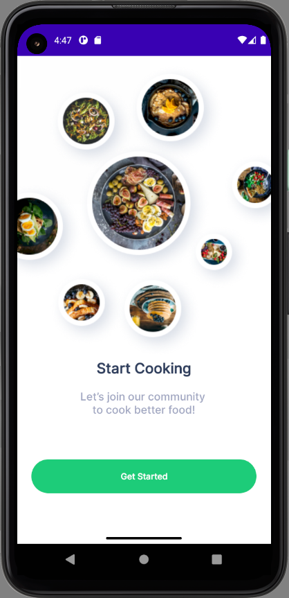
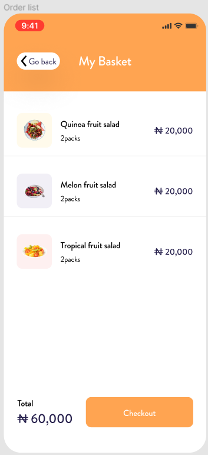
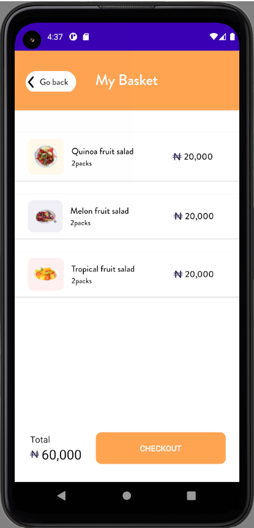
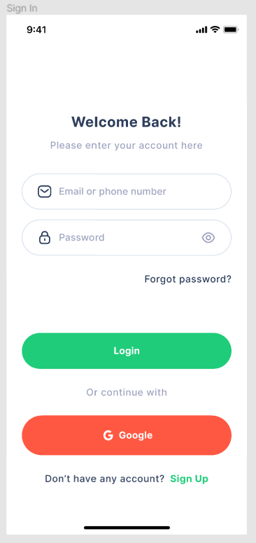
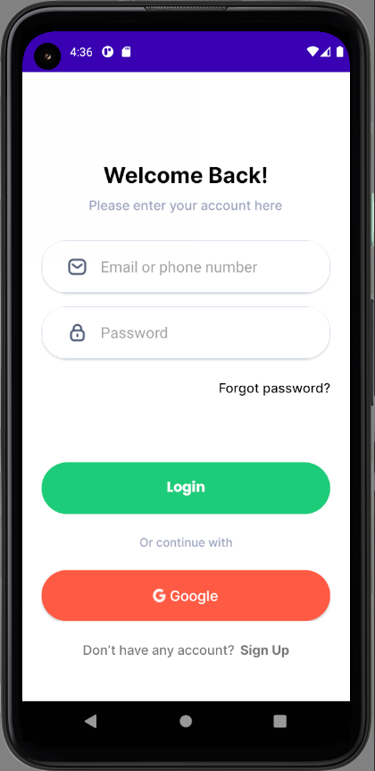
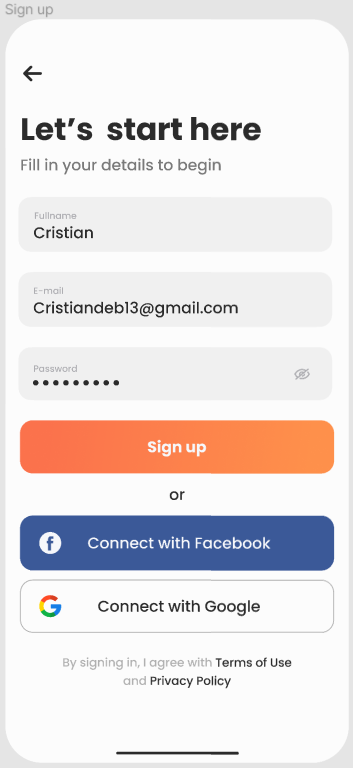
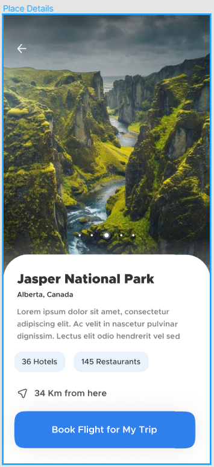
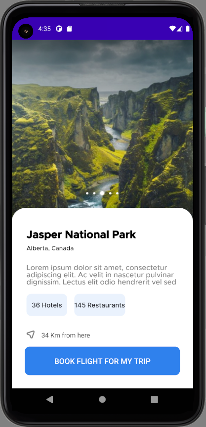

# Yemeksepeti Android Bootcamp Ödev 1

| Design                             | Design to Code                             |
| ---------------------------------- | ------------------------------------------ |
   
|  |  |
   
|  |  |
   
|  |  |
   
|  |  |
   
|  |  |
   
|  |  |
   
|  |  |
   
|  |  |
